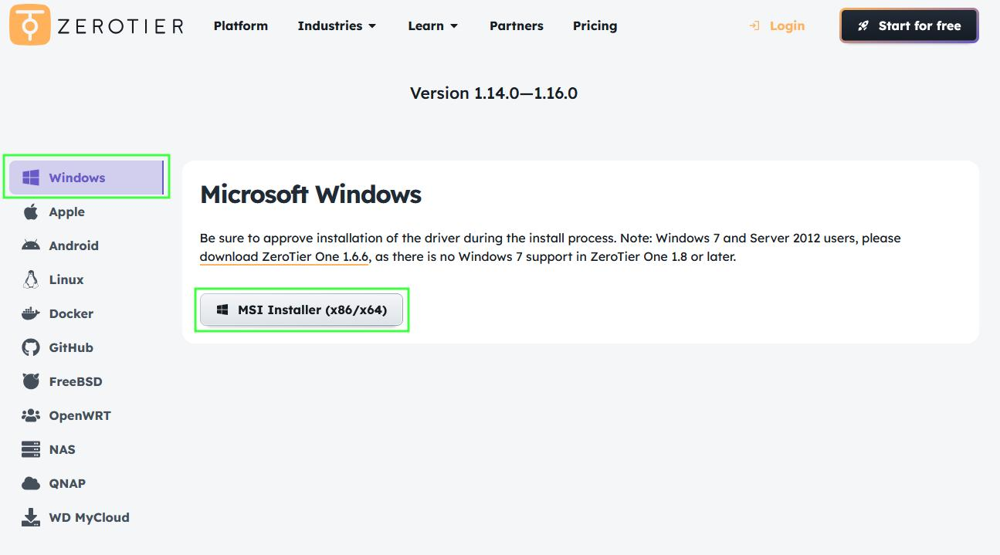
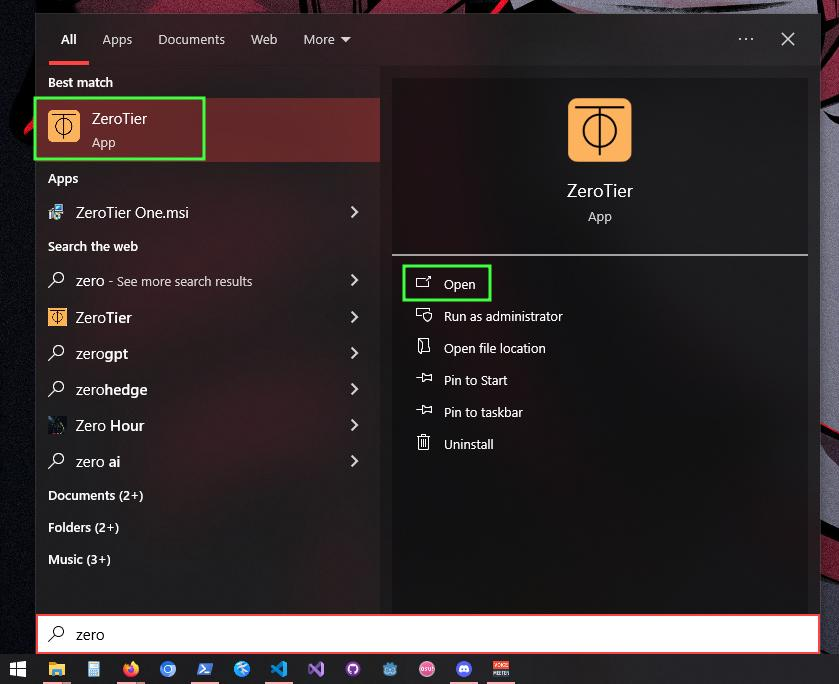
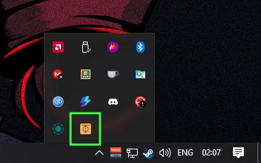
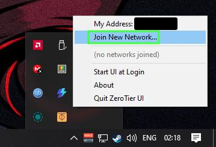
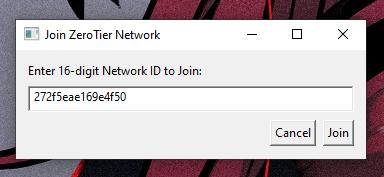
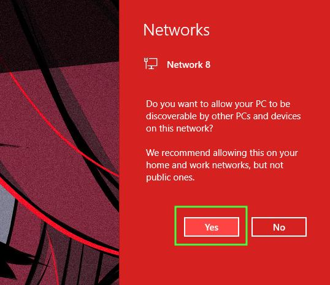
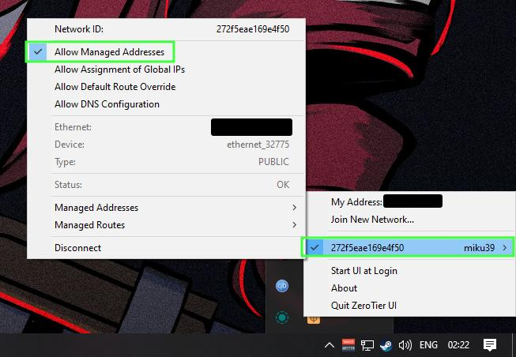
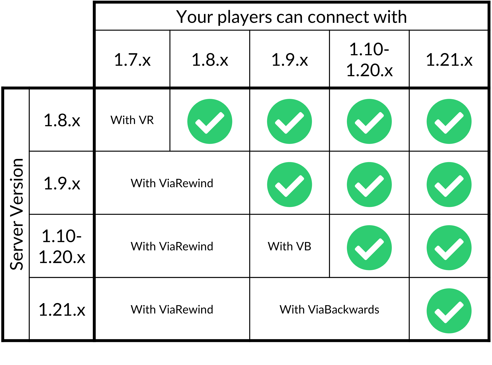

# How to Join
> ⚠ Important: Bedrock players **must** have an official copy of the game in order to join.

&nbsp;

---

## ▶ PlayIt (Simplest) ◀
If you just want to play and don't care too much about some network lag, this is the simplest way to join and start playing.

1. Choose the IP address and port for your edition of Minecraft.
2. Add it to your server list.
3. Click join!

### IP Addresses

| Platform | IP Address | Port |
| --- | --- | --- |
| Java | `name-condo.gl.joinmc.link` | `24156` |
| Bedrock | `remote-regardless.gl.at.ply.gg` | `38641` |

---

&nbsp;
## ZeroTier One (Faster Connection)

If you want better performance while playing, you can connect via a VPN to skip relaying through PlayIt. This reduces the latency between your device and the server. However, some setup is required.

**▶ Network ID: `272f5eae169e4f50` ◀**

| Platform | IP Address | Port |
| --- | --- | --- |
| Java | `10.242.128.205` | `25565` |
| Bedrock | `10.242.128.205` | `19132` |

### Windows
#### 1. Download and install the app from [their website](https://www.zerotier.com/download/).

#### 2. Launch the app.

#### 3. Click on the ZeroTier icon in your system tray.

#### 4. Click on "Join New Network".

#### 5. Enter the network ID (see above) and click "Join".

#### 6. A Windows pop-up will appear asking if you want your device to be discoverable--click "Yes".

#### 7. Open the app again. Hover over "miku39" in the list and make sure "Allow Managed Addresses" is enabled.

#### 8. Choose the IP address and port for your edition of Minecraft.

#### 9. Add it to your server list.

#### 10. Click join!

&nbsp;

### Android / iOS
1. Download and install the app from [Google Play](https://play.google.com/store/apps/details?id=com.zerotier.one) or [Apple App Store](https://apps.apple.com/us/app/zerotier-one/id1084101492).
2. Launch the app.
3. Tap on "Add Network".
4. Enter the network ID and tap on "Add".
5. You will see the network you just added on the list as an unnamed network--switch it on.
6. A pop-up will appear asking to add ZeroTier One as a VPN on your device. Tap on "OK".
7. You're ready to go!
8. Choose the IP address and port for your edition of Minecraft.
9. Add it to your server list.
10. Click join!

&nbsp;

### Linux
figure it out

*It's not actually difficult, I just don't want to write the instructions for something no one will need.*

&nbsp;

### macOS
imagine using macOS 🤣

&nbsp;

# Versions
Thanks to ViaBackwards, y'all should be able to join with any Minecraft release since `1.9`.

Similarly, ViaVersion allows newer versions (e.g., `1.21.11`) to join the server, which is still running `1.21.10` due to plugin support.

> Note: Certain blocks, entities, and behavior might be different; the plugin is trying to emulate them as accurately as possible without requiring mods.

# Don't have Minecraft?
## Java
Try [this launcher](https://mc-launcher.com/wp/minecraft/) I used to use for years! As always, do so at your own risk.

## Bedrock
Buy it or ask someone to buy it for you. Cracked Bedrock clients cannot join at this time.
